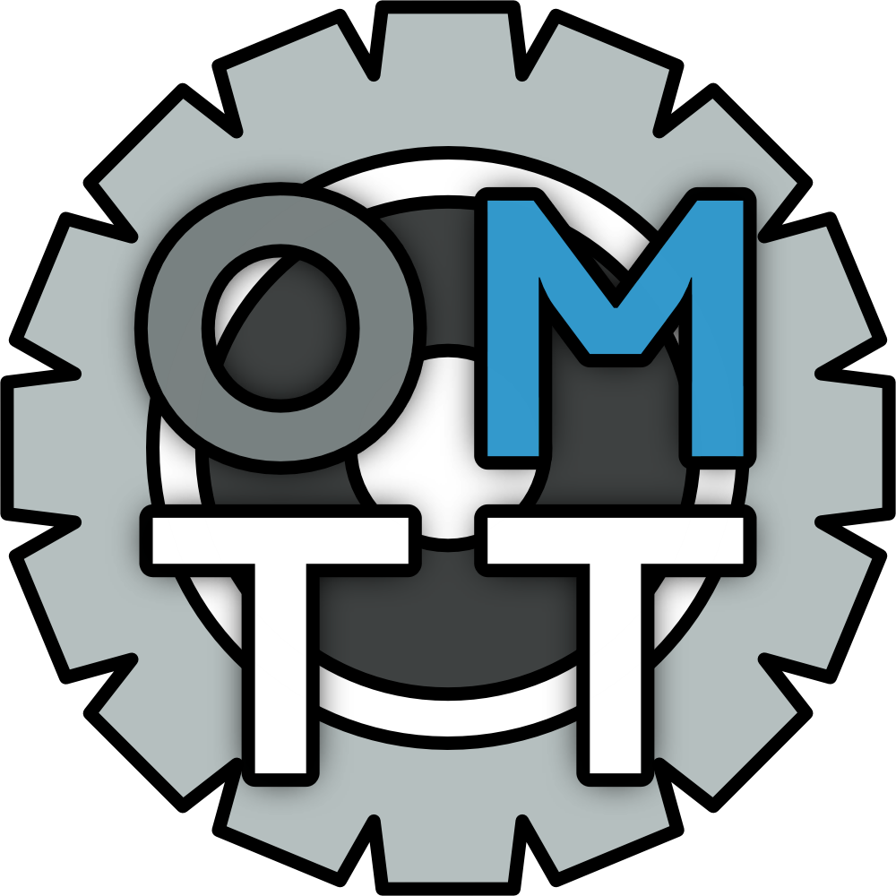



  

# Open Madness Track Tools
This repository consists of a set of scripts, a Blender plugin, and program source code enabling development of original track models for Slightly Mad Studios' Madness Engine racing games (tested with Project CARS 2 and Reiza Studios' Automobilista 2).

## Disclaimer
This is an unofficial, independent project. It is not affiliated with, authorized by, endorsed by, or sponsored by Reiza Studios, Slightly Mad Studios, or any of their affiliates. "Automobilista 2", "Project CARS", "Madness Engine", and all related names and marks are the property of their respective owners and are used here only to identify the software this toolkit interoperates with.

No game assets or game code are distributed by this project. You must own a legitimate copy of the target game to use this toolkit.

## About Porting and Unauthorized Use
This toolkit has been designed for facilitating the creation of original content for Madness Engine games. I and the other contributors have deliberately not given it facilities for importing or modifying existing game data, or for converting prior work from other games to games running on the Madness Engine, even content you have the rights to work with. Porting, converting, or reprocessing work you did not create is counter to the core purpose and motivation of the toolkit.

The toolkit grants you no rights in anything. Running a file through these tools does not transfer, create, or launder ownership or permission to use or distribute its outputs. If you did not create the input, you do not own the output. If you did not create some part of the input, you do not own that part of the output. This covers every kind of output the toolkit can create: binary-packed meshes, material definition data, scenegraphs, hierarchies, AI waypoints, cameras, lights, sounds, LiveTrack data, vehicles, and anything else.

Processing another person's work without their informed and verifiable permission is not permitted by this project. That includes:
- Converting tracks, cars, or any other assets from other games or mods
- Editing, re-exporting, or redistributing content that was already built for a Madness Engine game by someone else, including the official game developers and third-party creators, whether authorized by the official developers or not
- Using any source data you do not have the rights to use

This conduct likely infringes the original artist's copyright, may breach the licence and end-user terms that the work was originally released under, and does real harm to the people who created it. Anyone who does this is solely and personally responsible for it, including any takedowns, account or community bans, damages, legal costs, and other legal consequences that follow. The authors of this toolkit do not authorize, condone, or accept any responsibility for it, and will cooperate with rights holders who act against it within the limits of what they can do. The toolkit contains no telemetry, tracking, or licensing system, so the authors have no records of who downloads or uses it.

If the original artist has explicitly given you permission to reprocess their work, that is acceptable, though still discouraged and still unsupported.

Ported and unauthorized content receives zero support. Issues, questions, bug reports, and pull requests involving it, or aimed at making porting easier, will be closed without response.

## Limitations:
I want people to be aware of the limitations of the current methodology upfront. Here is the non-exhaustive list of features that are not yet working:

### VHF instance hierarchies and IMB instance models can't be added to a track
This is because the SGX format does not support referencing these files. Certain scene preparation code, which runs if an SGB64 is loaded, doesn't run in the SGX loading pipeline.
The SGB64 format does support VHFs and IMBs, as evidenced by filepath strings containing references to VHF and IMB files inside them, but the SGB64 format is and will remain undocumented.

### LiveGrass isn't implemented
I haven't begun research into the LiveGrass system because I highly suspect it'll only work with SGB64-formatted scenegraphs, not SGXs, for the reasons listed above, because the LiveGrass system likely makes heavy use of instancing.

## Contents:

### OMTT Docs
In the development of this toolkit, I conducted extensive research into the Madness Engine and the file formats it uses. These are some of the notes I took on each file format and the file structure of tracks in both games.

### PhysicsMeshCooker
A command-line utility that prepares LiveTrack geometry data (PhysX cooked collision meshes) from FBX files using NVIDIA PhysX 3.3.4.

### TrackCompiler
A Blender addon that handles all Madness-specific track exporting and related authoring. 
It has the following capabilities:
- Export a Blender scene into a collection of MEBs (mesh binaries) and MTXs (material XML files) and a corresponding SGX (scenegraph XML file)
    - Automatically copy all MTX-referenced textures to the correct place in a placeholder game folder structure
- Import, export, and create new loose MTXs linked to a Blender material (defined independently from it, but organized alongside it)
- Export selected Blender objects or the entire active Blender scene to a single MEB file + MTX file(s) for special purposes (such as preparation of custom dynamic physics objects)
- Export an AIW (AI Waypoints) file from a set of scene objects with a specific mesh topology, attributes, and naming convention (see Example Files)
- Export a LiveTrack Weathering-In MRDF (Madness "Machine-Readable Data Format") from an object with a specifically formatted Geometry Nodes setup (see Example Files)
- Export a `triggers.xml` file containing timing gate and other trigger zone information from a set of scene objects with a specific naming convention (see Example Files)
- Export a Cameras XML file from a set of scene objects with a specific naming convention, configured data, placements, and orientation (see Example Files)
- Export a Lights SGX file from a set of scene objects with a specific naming convention, configured data, placements, and orientation (see Example Files)
- Export a paired `dynamic_objects.xml` and `trackname.env.xml` dynamic physics objects layout fileset, along with each object's visual mesh, materials, and textures under `tracks/_data/dynamic`
- Export a vehicle VHF hierarchy (LOD groups, damage pairs, part matrices) with the MEBs and MTX files it references
- Export a Level Sound Definition LSD file from a set of scene objects with a specific naming convention, configured data, placements, and orientation (see Example Files)
- Export a LiveTrack Point Grid and track cut area GCL file from a set of scene objects representing the drivable surface of the track (see Example Files)

### SplineRecorder
A Python tool that records the player car's position while driving around a track and allows export of that data to CSV files. These CSV files can then be imported to Blender after installing the one-file Blender addon `import_racing_line.py`. The resultant curve objects can then be further transformed into AIW source data meshes by hand, following the tutorial (see OMTT Docs).
Contains the following:
- `spline_recorder.py` is the Python tool itself, providing a GUI showing the recording/export controls and recorded laps.
- `shared_memory.py` is a Python script called by the recorder which handles acquisition and processing of the telemetry frames from AMS2's shared memory.
- `recorder.py` is a Python file handling recording of data from `shared_memory.py`.
- `import_racing_line.py` is the single-file Blender addon which provides import of the CSV files exportable from `spline_recorder.py`.

### TrackPacker
A command-line utility that converts and packs files for distribution and installation with [Paolo Ambrosio's AMS2 CM](https://github.com/OpenSimTools/AMS2CM/). This is distributed in each release as `PackTrack.exe`; a PyInstaller-built version of the `pack_track.py` script; which can be used instead if you have Python installed.
Contains the following:
- `bff_creator.py` is a Python script that is capable of creating a new valid BFF from loose files. It does not and will not support BFF encryption; no code that supports BFF encryption is included or will be included.
- `mtx2bmt.py` is a Python script that is capable of converting MTX material definition XML files to BMT binary material files.
- `pack_track.py` is a Python script that performs the actual packing of a template folder structure (such as the one provided in the Example Project) into a `.zip` file ready for installation with the aforementioned Content Manager.
- Seasonal variation BFFs are generated at pack time rather than shipped. Every track needs a pak for every season, so each seasonal pak is built to contain a single placeholder mesh plus its material. The texture that material references comes from the game's tree atlas, which is already mounted at boot time.

### Example Project
This contains a Blender project file, textures, and a shell track file structure ready to be exported into.
It is designed as a tutorial project to teach track developers about how the Madness engine works.
To that end, it contains a Tutorial.md that should be followed by anyone interested in using this toolkit.
The Blender project file contains a basic track model and preconfigured setups for the following exporters:
- AI Waypoints `AIW`
- LiveTrack Weathering-In `MRDF`
- Cameras `XML`
- Triggers `XML`
- Lights `SGX`
- Scene `SGX`

## License
This project is free software. Different components carry different licenses:

| Component | License |
| --- | --- |
| `TrackCompiler` | [GPL-3.0-or-later](LICENSE) + [output exception](LICENSE-EXCEPTION.txt) |
| `TrackPacker` | [GPL-3.0-or-later](LICENSE) + [output exception](LICENSE-EXCEPTION.txt) |
| `SplineRecorder` | [GPL-3.0-or-later](LICENSE) + [output exception](LICENSE-EXCEPTION.txt) |
| `PhysicsMeshCooker` | [MIT](PhysicsMeshCooker/LICENSE) |
| `OMTT Docs` | [CC BY-SA 4.0](OMTT%20Docs/LICENSE) |
| `Example Project` | CC BY 4.0 |

### Original tracks you make with this are yours
The copyleft terms apply to this toolkit and to derivatives of it. They do not apply to the files the tools produce. The [output exception](LICENSE-EXCEPTION.txt) states this explicitly. If you created the inputs, the output is yours: you may license it however you like, and you may sell it. If you did not create the inputs, see [Porting and Unauthorized Use](#porting-and-unauthorized-use).

### Contributing and naming
See [CONTRIBUTING.md](CONTRIBUTING.md) for the sign-off requirement, and [TRADEMARKS.md](TRADEMARKS.md) for how the project name may be used.